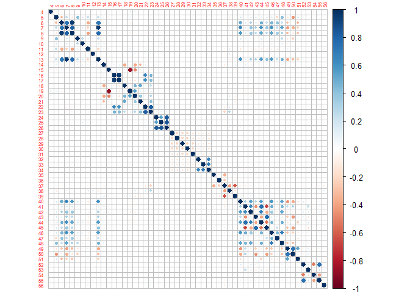
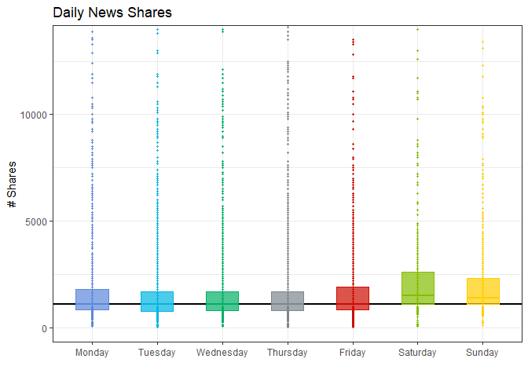

ST558 Project 2: News Popularity
================
Evan Brown & Daniel Craig
7/7/2022

-   [Automation for Later, to be deleted. It is in the
    ReadME](#automation-for-later-to-be-deleted-it-is-in-the-readme)
-   [**Introduction**](#introduction)
-   [**Data**](#data)
-   [**Modeling**](#modeling)
    -   [Linear Regression Models](#linear-regression-models)
    -   [Ensemble Models](#ensemble-models)
-   [**Comparison**](#comparison)

# Automation for Later, to be deleted. It is in the ReadME

``` r
channel <- c("lifestyle", "entertainment", "bus", "socmed", "tech", "world")

output_file = paste0(channel, ".md")

params <-lapply(channel, FUN = function(x){list(channel=x)})

reports <- tibble(output_file, params)

apply (reports, MARGIN =1, FUN= function(x) {
  rmarkdown::render("project2.Rmd", output_file = x[[1]], output_format="github_document", params = x[[2]])
  })
```

# **Introduction**

These R packages are required.

[tidyverse](https://www.tidyverse.org/packages/)  
[randomForest](https://www.tutorialspoint.com/r/r_random_forest.htm)  
[gbm](https://www.rdocumentation.org/packages/gbm/versions/2.1.8)  
[ggsci](https://cran.r-project.org/web/packages/ggsci/vignettes/ggsci.html)  
[corrplot](https://cran.r-project.org/web/packages/corrplot/vignettes/corrplot-intro.html)  
[caret](https://cran.r-project.org/web/packages/caret/vignettes/caret.html)  
[knitr](https://rmarkdown.rstudio.com/lesson-7.html)  
[reshape2](https://cran.r-project.org/web/packages/reshape2/index.html)

``` r
#Reading in required packages
library(tidyverse)
library(randomForest)
library(gbm)
library(ggsci)
library(corrplot)
library(caret)
library(knitr)
library(reshape2)
```

# **Data**

Here, we’ll get started by reading in the Online News Popularity data
and sub-setting by news category (news channel). Additionally, URL and
timedelta (columns 1 and 2) are non-predictive variables thus we’ll also
remove them from the main data set to create a data set to model with
later on.

``` r
#Reading in Online News Popularity Data set using relative path 
sharesData <- read_csv("OnlineNewsPopularity.csv")

#Subsetting for business news
busData <- subset(sharesData, sharesData$data_channel_is_bus == 1)

#Removing non-predictors to create data set to model from
modelData <- busData[,-c(1,2)]
```

After reading the data in and sub-setting by news category, the first
thing we’ll look at is some basic summary statistics of the data set for
each category. These summaries will include a minimum, median (less
sensitive to outliers), mean, max and 98th quantile. Since what we care
about is predicting shares of future articles, some outliers in this
data set may skew what the majority of our data look like. As such,
we’ll find the 98th quantile and occasionally look at this as
representative of the *majority* of the data.

``` r
#Find 98th quantile
quant98 <- busData %>% summarise(q98 = quantile(shares, .98))

#Create basic summary statistics (include quantile)
sharesStats <- busData %>% summarise(Min = min(shares), Median = median(shares), Mean = mean(shares), q98 = quantile(shares, 0.98), Max = max(shares), "# Articles in Top 2%" = sum(busData$shares > quant98$q98, na.rm = TRUE), "# Total Articles" = length(shares))

#Display stats in a nice table
stats <- melt(sharesStats)
colnames(stats) = c("Stat", "Value")
kable(stats)
```

| Stat                  |      Value |
|:----------------------|-----------:|
| Min                   |      1.000 |
| Median                |   1400.000 |
| Mean                  |   3063.019 |
| q98                   |  13900.000 |
| Max                   | 690400.000 |
| \# Articles in Top 2% |    125.000 |
| \# Total Articles     |   6258.000 |

Now that we have some basic numerical summaries, we want to visualize
what the majority of article shares looks like. To do this, we’ll look
at a histogram distribution of the 98th quantile of shares data to get a
feel for what the distribution of the majority of shares data looks
like.

``` r
#Create histogram of shares 
sharesHist <- ggplot(busData, aes(x=shares)) +  
  theme_bw() +                                                                     #Set classic bw plot theme
  geom_histogram(color="black", fill = "#34495E", alpha = 0.8, binwidth = 100) +   #Color options, binwidth set to 100 shares
  labs(x = "Shares", y = "Count", title = "Shares Distribution", 
       subtitle = "of 98th Quantile") +                                            #Set axis labels
  coord_cartesian(xlim = c(0, sharesStats$q98))                                    #Set x axis limits

#Display plot
sharesHist
```

<!-- -->

Now that we’ve seen some numerical summaries and the general
distribution of shares data, let’s look at the number of shares per news
piece for each day of the week. To do this, we’ll subset the data by the
mapping ‘weekday =’ variable and bind each daily subset back together to
create a column corresponding to day of the week. From there, we’ll
create a box plot of number of shares across each day of the week for
that news category. We’ll then add a line corresponding to the **total
median** number of shares. Finally, in order to visualize the box plots
appropriately, the y axis has been scaled to show just the 98th quantile
of the data, but the values inside the box plots are still
representative of the data in it’s entirety.

As a result of constructing daily box plots, we can inspect the 5-number
summary (min, q1, median, q3, max) for the number of shares for each day
of the week and compare this to the overall median number of shares
(black horizontal line). If a daily median is higher than the total
median, then articles tend to get shared more on that day. If a daily
median is lower than the total median, then articles tend to get shared
less.

``` r
#Subset full data by each day
Mon <- subset(busData, busData$weekday_is_monday == 1)
Tues <- subset(busData, busData$weekday_is_tuesday == 1)
Wed <- subset(busData, busData$weekday_is_wednesday == 1)
Thur <- subset(busData, busData$weekday_is_thursday == 1)
Fri <- subset(busData, busData$weekday_is_friday == 1)
Sat <- subset(busData, busData$weekday_is_saturday == 1)
Sun <- subset(busData, busData$weekday_is_sunday ==1)

#Add day column
Mon <- Mon %>% mutate(Day = "Monday")
Tues <- Tues %>% mutate(Day = "Tuesday")
Wed <- Wed %>% mutate(Day = "Wednesday")
Thur <- Thur %>% mutate(Day = "Thursday")
Fri <- Fri %>% mutate(Day = "Friday")
Sat <- Sat %>% mutate(Day = "Saturday")
Sun <- Sun %>% mutate(Day = "Sunday")

#Create data frame with day column corresponding to days
DayData <- rbind(Mon, Tues, Wed, Thur, Fri, Sat, Sun)


#Create order of days
DayOrder <- as.factor(c("Monday", "Tuesday", "Wednesday", "Thursday", "Friday", "Saturday", "Sunday"))

#Create vertical boxplot of shares based on day of the week  
DayPlot <- ggplot(DayData, aes(x = factor(Day, level = DayOrder), y = shares, fill = Day, color = Day)) + 
  theme_bw() +                                                              #Set classic bw plot theme
  geom_hline(yintercept = median(DayData$shares), size = 0.8) +             #Add line for overall median shares
  geom_point(size = 0.8) +                                                  #Add points
  geom_boxplot(lwd = 0.5, width = 0.5, outlier.size = 0.8, alpha = 0.7) +   #Create boxplot
  coord_cartesian(ylim = c(0, quant98$q98)) +                               #Set y axis limits (plot to 98th quant)
  xlab("") + ylab("# Shares") +                                             #Label axis
  theme(legend.position = "none") +                                         #Remove legend
  ggtitle("Daily News Shares") +                                            #Set title
  scale_color_startrek() + scale_fill_startrek()                            #Set color theme

#Display plot
DayPlot
```

<!-- -->

Now that we’ve evaluated differences in daily sharing, let’s take a look
at sentiment polarity. Sentiment polarity for a news piece explains the
orientation of the expressed sentiment(i.e. It determines if the piece
expresses a negative, neutral, or positive overall sentiment from the
readers point of view). Values for sentiment polarity range from -1 to
1, with -1 being very negative, 0 being neutral, and 1 being very
positive. The plot below has a color scaled x-axis that will populate
shares data points as red if it’s negative, yellow if it’s neutral, and
green if it’s positive. If there are a high number of shares in the
negative region, then those shares are coming from more negative pieces.
If there are a high number of shares in the positive region, then those
shares are coming from more positive pieces. A majority of shares around
0 would imply that most shares come from neutrally composed pieces.

``` r
#Create sentiment polarity scatter plot
polarityPlot <- ggplot(data = busData, aes(x = global_sentiment_polarity, y = shares)) + 
  geom_point(aes(colour = global_sentiment_polarity), alpha = 0.4) +  #Set fill by polarity
  theme_bw() +                                                       #Set classic bw plot theme   
  coord_cartesian(ylim = c(0, 50000), xlim = c(-1,1)) +              #Set axis limits
  xlab("Sentiment Polarity") + ylab("# Shares") +                    #Label axis
  ggtitle("Shares Across Sentiment Polarity Scale") +                #Set title
  scale_colour_gradientn("Sentiment Polarity",                       #Set legend title
                         colors = c("#F31C10","#F1C40F", "#2BCF0E"), #Set colors for x-axis gradient
                         limits = c(-1,1))                           #Setting axis-wide gradient limits
  
#Display plot
polarityPlot
```

<!-- -->

Now let’s take a look at how the relation of shares to the number of
words per content piece.

``` r
#Create sentiment polarity scatter plot
wordsPlot <- ggplot(data = busData, aes(x = n_tokens_content, y = shares)) + 
  geom_point(aes(colour = n_tokens_content), alpha = 0.4) +          #Set fill by number of words
  theme_bw() +                                                       #Set classic bw plot theme   
  coord_cartesian(ylim = c(0, 50000)) +                              #Set axis limits
  xlab("Word Count") + ylab("# Shares") +                            #Label axis
  ggtitle("Shares versus Word Count") +                              #Set title
  scale_colour_gradientn("Word Count",                               #Set legend title
                         colors = c("#9ABBF6","#6E0FAD", "#BF0A1A")) #Set colors for x-axis gradient

#Display plot
wordsPlot
```

<!-- -->

# **Modeling**

In this section, we will demonstrate fitting statistical models to our
data in order to predict news article shares. We will fit 2 linear
regression models (both Multiple Linear Regressions) and 2 ensemble
models (Random Forest and Boosted Tree). Before we begin fitting models,
it is imperative we split our data set into a “training” and a “testing”
set. Fitting a model on your entire data set leaves you no data to test
the models predictive capabilities on, and can over fit the model. In
contrast, training the model on too little of your data set may under
fit the model and result in a model that is bad at making predictions.
In this analysis, we will use 70% of our data to train on and the other
30% will be used to test on. Let’s go ahead and split the data now.

``` r
#Make things reproducible
set.seed(100)

#Split the data 70/30
split <- createDataPartition(y = modelData$shares, p = 0.7, list = FALSE)
training <- modelData[split, ]
testing <- modelData[-split, ]
```

Now that we’ve split our data into a training and testing set, lets fit
models to the training data.

### Linear Regression Models

Let’s start with linear regression. Linear regression modeling is a
statistical method for characterizing the linear association between 2
or more variables. This method works by associating a distribution of a
response variable to a value of a predictor(s). Characterizing 2
variables (one response, one predictor) is referred to as Simple Linear
Regression, while characterizing more than 2 variables (one response,
multiple predictors) is referred to as Multiple Linear Regression. For
this data, we’ll use variations of Multiple Linear Regression models to
capture as many predictors as possible. Our response variable will be
‘shares’, which is what we are interested in predicting with our models.
To know if our models are doing good, we’ll look at their accuracy in
predicting shares in the testing data set later on.

Alright, now that we have some basic idea of linear regression models,
let’s fit them. The first model will be a fit of shares as a function of
the interaction between each predictor evaluated earlier (article word
count, sentiment polarity, and day of the week). The second model will
be a fit of shares as a function of all predictors in the data set.

``` r
#Make things reproducible
set.seed(100)

#Linear Regression Model 1
linearModel1 <- train(shares ~ n_tokens_content*global_sentiment_polarity*
                        weekday_is_monday*weekday_is_tuesday*weekday_is_wednesday*
                        weekday_is_thursday*weekday_is_friday*weekday_is_saturday*
                        weekday_is_sunday, 
                      data = training,                          #Shares as function of all predictors
                      method = "lm",                            #Linear model method
                      trControl = trainControl(method = "cv",   #Use cross validation to select
                                               number = 10)) 

#Linear Regression Model 2
linearModel2 <- train(shares ~ ., data = training,              #Shares as function of all predictors
                      method = "lm",                            #Linear model method
                      trControl = trainControl(method = "cv",   #Use cross validation to select
                                               number = 10)) 
```

### Ensemble Models

Ensemble models are an approach that combines many models in the
prediction process. Two common example are Random Forests and Boosting
Trees. Random Forests use a decision (classification) tree for each
predictor in a random subset of predictors. Individually, each tree
breaks one predictor variable into multiple “nodes”. The number of nodes
will vary, but each node is fit to the data to minimize the residual sum
of squares (distance of each data point within the node range from the
node average). In this work, we have 59 predictors and as a rule of
thumb, Random Forests for regression prediction use a third of
predictors in their random subset. So for this data, our model will
cycle over random subsets of 20 variables; each split into their own
tree with many nodes. Working as an ensemble method, each individual
tree will be summed up to create a total model, then the best random
subset of predictors model will be chosen as the optimal model by Random
Forest modeling.

Boosting Trees \_\_\_\_\_\_\_.

Now, let’s fit these models.

``` r
#Random Forest Model
rfFit <- train(shares ~., data = training, 
               method = "rf",
               trControl = trainControl(method = "cv", number = 3),
               tuneGrid = data.frame(mtry = ncol(training)/3))


#Boosting Tree Model
boostedFit <- train(shares ~., data = training, method = "gbm",
                    trControl = trainControl(method = "cv", number = 3),
                    tuneGrid = expand.grid(n.trees = c(25, 50, 100, 150, 200),
                                           interaction.depth = 1:4,
                                           shrinkage = 0.1,
                                           n.minobsinnode = 10), verbose = FALSE)
```

# **Comparison**

Now that we’ve fit our models, we need to compare them to select for the
best one. We’ll start by combining the results of each model fit on the
training data set into a single data set. Then, we’ll use these models
to predict on the testing data set and combine those results into a
final data set with both a testing and training selection criteria
measurement (RMSE). The selection criteria we’ll use to choose a winning
model will be the Root Mean Squared Error (RMSE) of the testing
predictions (since making predictions is what we care about most). RMSE
captures the differences between values predicted by a model and values
observed in the testing data set and as such, is a measure of how
accurately the model predicts the response. The model with the lowest
RMSE on the testing data set predictions will be considered the best
model and the result will be populated below.

``` r
#Results of fits on training----

#Save results from each fit on the training set
lin1Results <- linearModel1$results
lin2Results <- linearModel2$results
rfResults <- rfFit$results
boostResults <- boostedFit$results

#combine RMSE results from each fit into data frame
modelResults <- cbind(lin1Results[,"RMSE"], lin2Results[,"RMSE"], rfResults[,"RMSE"], boostResults[1,"RMSE"])

#Change col & row names to match
modelResults <- melt(modelResults)
modelResults <- data.frame(modelResults[,c(-1, -2)])
rownames(modelResults) <- c("Linear Model 1", "Linear Model 2", "RF Model", "Boosted Model")
colnames(modelResults) <- c("Training RMSE")

#Prediction results with test set----

#Predict each model on the testing set
lm1Pred <- predict(linearModel1, newdata = testing)
lm2Pred <- predict(linearModel2, newdata = testing)
rfPred <- predict(rfFit, newdata = testing)
boostPred <- predict(boostedFit, newdata = testing)

#Get RMSE of each model tested on the testing set
lm1Test <- data.frame(postResample(lm1Pred, testing$shares))
lm2Test <- data.frame(postResample(lm2Pred, testing$shares))
rfTest <- data.frame(postResample(rfPred, testing$shares))
boostTest <- data.frame(postResample(boostPred, testing$shares))

combinedTestRMSE <- melt(cbind(lm1Test[1,], lm2Test[1,], rfTest[1,], boostTest[1,]))
combinedTestRMSE <- data.frame(combinedTestRMSE[,c(-1, -2)])
rownames(combinedTestRMSE) <- c("Linear Model 1", "Linear Model 2", "RF Model", "Boosted Model")
colnames(combinedTestRMSE) <- c("Testing RMSE")

#Combine
finalResults <- cbind(modelResults, combinedTestRMSE)

#Print table of values for visualization of RMSE
kable(finalResults)
```

|                | Training RMSE | Testing RMSE |
|:---------------|--------------:|-------------:|
| Linear Model 1 |     10399.032 |     18347.14 |
| Linear Model 2 |      9901.118 |     18215.37 |
| RF Model       |     13376.310 |     18475.70 |
| Boosted Model  |     12620.387 |     18474.11 |

``` r
#Select the winner based on testing RMSE
lowRMSE <- min(finalResults[,2])
lowModel <- subset(finalResults, finalResults$`Testing RMSE`== lowRMSE)
lowModelName <- paste0("The winning model is: ", rownames(lowModel))
```

After evaluating the metrics, the winning model is…

| x                                    |
|:-------------------------------------|
| The winning model is: Linear Model 2 |

Awesome. Now that we have our winning model, we can use this to predict
shares of future news articles. This will be very useful going forward!

``` r
OrigNames <- colnames(busData) 

colnames(busData) <- 1:length(busData)


colnames(busData) <- OrigNames 

Correlation <- busData %>% select(-starts_with("data_channel"), -"url", -"ShareStatus")
Correlation <- cor(Correlation)

corOrigNames <- dimnames(Correlation)[[2]]


dimnames(Correlation)[[2]] <- 1:ncol(Correlation)
dimnames(Correlation)[[1]] <- 1:ncol(Correlation)
corrplot(Correlation, type = "upper", tl.pos = "lt", cl.cex = .8, tl.cex = .5, number.font = .7)
corrplot(Correlation, type = "lower", method = "number", diag = FALSE, tl.pos="n", add = TRUE)
```
