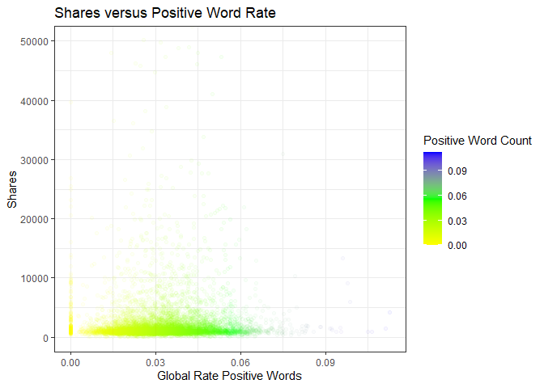
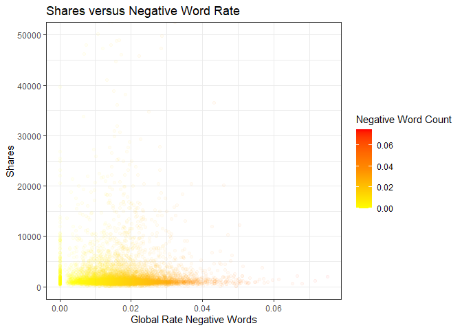

ST558 Project 2: News Popularity
================
Evan Brown & Daniel Craig
7/7/2022

-   [Introduction](#introduction)
    -   [Packages Used](#packages-used)
-   [Introduction to Overall Data](#introduction-to-overall-data)
    -   [Top 50 Posts](#top-50-posts)
-   [Specific Channel Summary](#specific-channel-summary)
    -   [Summary Stats](#summary-stats)
    -   [Histogram Summary](#histogram-summary)
    -   [Correlation](#correlation)
    -   [Day Variable Summary](#day-variable-summary)
    -   [Sentiment Polarity Summary](#sentiment-polarity-summary)
    -   [Positive/Negative Words
        Summary](#positivenegative-words-summary)
    -   [Title Sentimentality Summary](#title-sentimentality-summary)
    -   [Title Subjectivity Summary](#title-subjectivity-summary)
-   [Modeling](#modeling)
    -   [Linear Regression Models](#linear-regression-models)
    -   [Ensemble Models](#ensemble-models)
-   [Comparison](#comparison)

# Introduction

Our data for analysis was pulled from the following
[source](https://archive.ics.uci.edu/ml/datasets/Online+News+Popularity)
that was used in this paper “A Proactive Intelligent Decision Support
System for Predicting the Popularity of Online News.” Which can be
downloaded [here](https://core.ac.uk/download/pdf/55638607.pdfaz)

The paper was written in support of their Intelligent Decision Support
System as a tool for publishers and writers to improve their articles to
gain more shares and views. Their study found that a random forest model
was the most useful with a discrimination power of 73%. In comparison,
our final model was a linear model.

A list of variables and their meaning is found below. Pay attention to
their numbers as it indicates their placement on a correlation plot
later. The variable of interest will be \#56.

Description of Variables:

1.  Date
2.  Title
3.  TimeDelta
4.  n_tokens_title: Number of words in the title
5.  n_tokens_content: Number of words in the content
6.  n_unique_tokens: Rate of unique words in the content
7.  n_non_stop_words: Rate of non-stop words in the content
8.  n_non_stop_unique_tokens: Rate of unique non-stop words in the
    content
9.  num_hrefs: Number of links
10. num_self_hrefs: Number of links to other articles published by
    Mashable
11. num_imgs: Number of images
12. num_videos: Number of videos
13. average_token_length: Average length of the words in the content
14. num_keywords: Number of keywords in the metadata
15. kw_min_min: Worst keyword (min. shares)
16. kw_max_min: Worst keyword (max. shares)
17. kw_avg_min: Worst keyword (avg. shares)
18. kw_min_max: Best keyword (min. shares)
19. kw_max_max: Best keyword (max. shares)
20. kw_avg_max: Best keyword (avg. shares)
21. kw_min_avg: Avg. keyword (min. shares)
22. kw_max_avg: Avg. keyword (max. shares)
23. kw_avg_avg: Avg. keyword (avg. shares)
24. self_reference_min_shares: Min. shares of referenced articles in
    Mashable
25. self_reference_max_shares: Max. shares of referenced articles in
    Mashable
26. self_reference_avg_sharess: Avg. shares of referenced articles in
    Mashable
27. weekday_is_monday: Was the article published on a Monday?
28. weekday_is_tuesday: Was the article published on a Tuesday?
29. weekday_is_wednesday: Was the article published on a Wednesday?
30. weekday_is_thursday: Was the article published on a Thursday?
31. weekday_is_friday: Was the article published on a Friday?
32. weekday_is_saturday: Was the article published on a Saturday?
33. weekday_is_sunday: Was the article published on a Sunday?
34. is_weekend: Was the article published on the weekend?
35. LDA_00: Closeness to LDA topic 0
36. LDA_01: Closeness to LDA topic 1
37. LDA_02: Closeness to LDA topic 2
38. LDA_03: Closeness to LDA topic 3
39. LDA_04: Closeness to LDA topic 4
40. global_subjectivity: Text subjectivity
41. global_sentiment_polarity: Text sentiment polarity
42. global_rate_positive_words: Rate of positive words in the content
43. global_rate_negative_words: Rate of negative words in the content
44. rate_positive_words: Rate of positive words among non-neutral tokens
45. rate_negative_words: Rate of negative words among non-neutral tokens
46. avg_positive_polarity: Avg. polarity of positive words
47. min_positive_polarity: Min. polarity of positive words
48. max_positive_polarity: Max. polarity of positive words
49. avg_negative_polarity: Avg. polarity of negative words
50. min_negative_polarity: Min. polarity of negative words
51. max_negative_polarity: Max. polarity of negative words
52. title_subjectivity: Title subjectivity
53. title_sentiment_polarity: Title polarity
54. abs_title_subjectivity: Absolute subjectivity level
55. abs_title_sentiment_polarity: Absolute polarity level
56. shares: Number of shares (target)

The models we built included the week variables (Linear Model 1), all
variables (Linear Model 2), and the ones we found to have some very
slight relationship with (Linear Model 3) per the correlation plot. We
also performed two boosted models with all variables and again the same
variables inside Linear Model 3, but was not as effective as our Linear
Models.

## Packages Used

These R packages are required.

[tidyverse](https://www.tidyverse.org/packages/)  
[randomForest](https://www.tutorialspoint.com/r/r_random_forest.htm)  
[gbm](https://www.rdocumentation.org/packages/gbm/versions/2.1.8)  
[ggsci](https://cran.r-project.org/web/packages/ggsci/vignettes/ggsci.html)  
[corrplot](https://cran.r-project.org/web/packages/corrplot/vignettes/corrplot-intro.html)  
[caret](https://cran.r-project.org/web/packages/caret/vignettes/caret.html)  
[knitr](https://rmarkdown.rstudio.com/lesson-7.html)  
[reshape2](https://cran.r-project.org/web/packages/reshape2/index.html)

``` r
#Reading in required packages
library(tidyverse)
library(randomForest)
library(gbm)
library(ggsci)
library(corrplot)
library(caret)
library(knitr)
library(reshape2)
```

# Introduction to Overall Data

The below section is an overall look at each data source in relation to
each other. Some data transformation was involved so that we could have
a new column to identify which news channel category it was from.
Pivot_longer was considered, but some issues were ran into and this was
another method to accomplish our goal.

We also added a title column so maybe we could get an idea of content
inside the post. One aspect that is difficult to capture is something
more specific than just a category. An example of what we are trying to
recreate is similar to how youtube adds tags to the video and allows the
author to add it. We also created a date column as well.

``` r
#Subset full data by each channel
Bus <- subset(sharesData, sharesData$data_channel_is_bus == 1)
Life <- subset(sharesData, sharesData$data_channel_is_lifestyle == 1)
Ent <- subset(sharesData, sharesData$data_channel_is_entertainment == 1)
Socmed <- subset(sharesData, sharesData$data_channel_is_socmed == 1)
Tech <- subset(sharesData, sharesData$data_channel_is_tech == 1)
World <- subset(sharesData, sharesData$data_channel_is_world == 1)


#Add Channel column
Bus <- Bus %>% mutate(channel = "bus")
Life <- Life %>% mutate(channel = "lifestyle")
Ent <- Ent %>% mutate(channel = "entertainment")
Socmed <- Socmed %>% mutate(channel = "socmed")
Tech <- Tech %>% mutate(channel = "tech")
World <- World %>% mutate(channel = "world")


#Create data frame with channel col
channelData <- rbind(Bus, Life, Ent, Socmed, Tech, World)

channelData <- channelData %>% select(-starts_with("data_channel_is"))

expandChannelData <- channelData %>% separate(url, c("http","site","com","year","month","day","title", sep="/", remove = FALSE))
expandChannelData <- expandChannelData %>% unite(title, title, "/", "FALSE",sep="-")

expandChannelData <- expandChannelData %>% select(-http,-site,-com)
expandChannelData <- expandChannelData %>% unite(date, year, month, day, sep = "/")
expandChannelData$date <- as.Date(expandChannelData$date)


print(expandChannelData)
```

## Top 50 Posts

Here we can see a list of the top 50 articles with their titles,
regardless of channel to see if there are any trends in content. We
could parse the titles later for common words.

``` r
top50 <- expandChannelData %>% select(shares,title,channel,date) %>% arrange(desc(shares)) %>% slice(1:50)

print(top50)
```

# Specific Channel Summary

Here, we’ll get started by reading in the Online News Popularity data
and sub-setting by news category (news channel). Additionally, URL and
timedelta (columns 1 and 2) are non-predictive variables thus we’ll also
remove them from the main data set to create a data set to model with
later on.

``` r
#Reading in Online News Popularity Data set using relative path 
sharesData <- read_csv("OnlineNewsPopularity.csv")

params$channel
```

    ## [1] "socmed"

``` r
specificChannelData
#Subsetting for business news
specificChannelData <- expandChannelData %>% filter(expandChannelData$channel == params$channel)
#specificChannelData <- subset(sharesData, sharesData$data_channel_is_bus == 1)

#Removing non-predictors to create data set to model from
modelData <- specificChannelData[,-c(2,3,57)] # removing title, timedelta, channel, maybe we remove date, and leave in timedelta?
```

## Summary Stats

After reading the data in and sub-setting by news category, the first
thing we’ll look at is some basic summary statistics of the data set for
each category. These summaries will include a minimum, median (less
sensitive to outliers), mean, max and 98th quantile. Since what we care
about is predicting shares of future articles, some outliers in this
data set may skew what the majority of our data look like. As such,
we’ll find the 98th quantile and occasionally look at this as
representative of the *majority* of the data.

``` r
#Find 98th quantile
quant98 <- specificChannelData %>% summarise(q98 = quantile(shares, .98))

#Create basic summary statistics (include quantile)
sharesStats <- specificChannelData %>% summarise(Min = min(shares), Median = median(shares), Mean = mean(shares),q25 = quantile(shares, .25), q50 = quantile(shares, .50), q75 = quantile(shares, .75), q98 = quantile(shares, 0.98), Max = max(shares), "# Articles in Top 2%" = sum(specificChannelData$shares > quant98$q98, na.rm = TRUE), "# Total Articles" = length(shares))

#Display stats in a nice table
stats <- melt(sharesStats)
colnames(stats) = c("Stat", "Value")
kable(stats)
```

| Stat                  |      Value |
|:----------------------|-----------:|
| Min                   |      5.000 |
| Median                |   2100.000 |
| Mean                  |   3629.383 |
| q25                   |   1400.000 |
| q50                   |   2100.000 |
| q75                   |   3800.000 |
| q98                   |  17300.000 |
| Max                   | 122800.000 |
| \# Articles in Top 2% |     46.000 |
| \# Total Articles     |   2323.000 |

## Histogram Summary

Now that we have some basic numerical summaries, we want to visualize
what the majority of article shares looks like. To do this, we’ll look
at a histogram distribution of the 98th quantile of shares data to get a
feel for what the distribution of the majority of shares data looks
like.

``` r
#Create histogram of shares 
sharesHist <- ggplot(specificChannelData, aes(x=shares)) +  
  theme_bw() +                                                                     #Set classic bw plot theme
  geom_histogram(color="black", fill = "#34495E", alpha = 0.8, binwidth = 100) +   #Color options, binwidth set to 100 shares
  labs(x = "Shares", y = "Count", title = "Shares Distribution", 
       subtitle = "of 98th Quantile") +                                            #Set axis labels
  coord_cartesian(xlim = c(0, sharesStats$q98))                                    #Set x axis limits

#Display plot
sharesHist
```

<!-- --> To wrap up our
initial look at the data, let’s take a look at the individual variables,
what they mean, and any relationships. Remember we are focusing on
shares as our goal. The variables we are working with are as follows:

## Correlation

Let’s view a correlation plot to see if any variables in particular are
related to each other. We will want to pay attention to column 56 to see
if there are any strong relationships.

``` r
OrigNames <- colnames(specificChannelData) # Saving names since we will overwrite them

colnames(specificChannelData) <- 1:length(specificChannelData) # Re name names to be numbers to save space


correlation <- specificChannelData %>% select(-c(1,2,3,57)) # Drop the non-relevant cols and make a new object
correlation <- cor(correlation) # Create our values

colnames(specificChannelData) <- OrigNames # Rename our columns back to normal

corrplot(correlation, tl.pos = "lt", cl.cex = .8, tl.cex = .5, number.font = .7) # Plot
```

<!-- -->

## Day Variable Summary

Now that we’ve seen some numerical summaries and the general
distribution of shares data, let’s look at the number of shares per news
piece for each day of the week. To do this, we’ll subset the data by the
mapping ‘weekday =’ variable and bind each daily subset back together to
create a column corresponding to day of the week. From there, we’ll
create a box plot of number of shares across each day of the week for
that news category. We’ll then add a line corresponding to the **total
median** number of shares. Finally, in order to visualize the box plots
appropriately, the y axis has been scaled to show just the 98th quantile
of the data, but the values inside the box plots are still
representative of the data in it’s entirety.

As a result of constructing daily box plots, we can inspect the 5-number
summary (min, q1, median, q3, max) for the number of shares for each day
of the week and compare this to the overall median number of shares
(black horizontal line). If a daily median is higher than the total
median, then articles tend to get shared more on that day. If a daily
median is lower than the total median, then articles tend to get shared
less.

``` r
#Subset full data by each day
Mon <- subset(specificChannelData, specificChannelData$weekday_is_monday == 1)
Tues <- subset(specificChannelData, specificChannelData$weekday_is_tuesday == 1)
Wed <- subset(specificChannelData, specificChannelData$weekday_is_wednesday == 1)
Thur <- subset(specificChannelData, specificChannelData$weekday_is_thursday == 1)
Fri <- subset(specificChannelData, specificChannelData$weekday_is_friday == 1)
Sat <- subset(specificChannelData, specificChannelData$weekday_is_saturday == 1)
Sun <- subset(specificChannelData, specificChannelData$weekday_is_sunday ==1)

#Add day column
Mon <- Mon %>% mutate(Day = "Monday")
Tues <- Tues %>% mutate(Day = "Tuesday")
Wed <- Wed %>% mutate(Day = "Wednesday")
Thur <- Thur %>% mutate(Day = "Thursday")
Fri <- Fri %>% mutate(Day = "Friday")
Sat <- Sat %>% mutate(Day = "Saturday")
Sun <- Sun %>% mutate(Day = "Sunday")

#Create data frame with day column corresponding to days
DayData <- rbind(Mon, Tues, Wed, Thur, Fri, Sat, Sun)


#Create order of days
DayOrder <- as.factor(c("Monday", "Tuesday", "Wednesday", "Thursday", "Friday", "Saturday", "Sunday"))

#Create vertical boxplot of shares based on day of the week  
DayPlot <- ggplot(DayData, aes(x = factor(Day, level = DayOrder), y = shares, fill = Day, color = Day)) + 
  theme_bw() +                                                              #Set classic bw plot theme
  geom_hline(yintercept = median(DayData$shares), size = 0.8) +             #Add line for overall median shares
  geom_point(size = 0.8) +                                                  #Add points
  geom_boxplot(lwd = 0.5, width = 0.5, outlier.size = 0.8, alpha = 0.7) +   #Create boxplot
  coord_cartesian(ylim = c(0, quant98$q98)) +                               #Set y axis limits (plot to 98th quant)
  xlab("") + ylab("# Shares") +                                             #Label axis
  theme(legend.position = "none") +                                         #Remove legend
  ggtitle("Daily News Shares") +                                            #Set title
  scale_color_startrek() + scale_fill_startrek()                            #Set color theme

#Display plot
DayPlot
```

<!-- -->

## Sentiment Polarity Summary

Now that we’ve evaluated differences in daily sharing, let’s take a look
at sentiment polarity. Sentiment polarity for a news piece explains the
orientation of the expressed sentiment(i.e. It determines if the piece
expresses a negative, neutral, or positive overall sentiment from the
readers point of view). The value we will be looking at is specific to
the text in the article. We will look at title sentiment later.

Values for sentiment polarity range from -1 to 1, with -1 being very
negative, 0 being neutral, and 1 being very positive. The plot below has
a color scaled x-axis that will populate shares data points as red if
it’s negative, yellow if it’s neutral, and green if it’s positive.

If there are a high number of shares in the negative region, then those
shares are coming from more negative pieces. If there are a high number
of shares in the positive region, then those shares are coming from more
positive pieces. A majority of shares around 0 would imply that most
shares come from neutrally composed pieces.

``` r
#Create sentiment polarity scatter plot
polarityPlot <- ggplot(data = specificChannelData, aes(x = global_sentiment_polarity, y = shares)) + 
  geom_point(aes(colour = global_sentiment_polarity), alpha = 0.4) +  #Set fill by polarity
  theme_bw() +                                                       #Set classic bw plot theme   
  coord_cartesian(ylim = c(0, 50000), xlim = c(-1,1)) +              #Set axis limits
  xlab("Sentiment Polarity") + ylab("# Shares") +                    #Label axis
  ggtitle("Shares Across Sentiment Polarity Scale") +                #Set title
  scale_colour_gradientn("Sentiment Polarity",                       #Set legend title
                         colors = c("#F31C10","#F1C40F", "#2BCF0E"), #Set colors for x-axis gradient
                         limits = c(-1,1))                           #Setting axis-wide gradient limits
  
#Display plot
polarityPlot
```

<!-- -->

To wrap up our text analysis, let’s take a look at how the relation of
shares to the number of words per content piece.

``` r
#Create sentiment polarity scatter plot
wordsPlot <- ggplot(data = specificChannelData, aes(x = n_tokens_content, y = shares)) + 
  geom_point(aes(colour = n_tokens_content), alpha = 0.4) +          #Set fill by number of words
  theme_bw() +                                                       #Set classic bw plot theme   
  coord_cartesian(ylim = c(0, 50000)) +                              #Set axis limits
  xlab("Word Count") + ylab("# Shares") +                            #Label axis
  ggtitle("Shares versus Word Count") +                              #Set title
  scale_colour_gradientn("Word Count",                               #Set legend title
                         colors = c("#9ABBF6","#6E0FAD", "#BF0A1A")) #Set colors for x-axis gradient

#Display plot
wordsPlot
```

<!-- -->

## Positive/Negative Words Summary

We’ve seen how sentiment from text inside the post can impact shares.
Let’s take a look at the rate of positive and negative words relate to
shares. We would expect these to be similar to our sentiment graphs as
positive/negative words are the building blocks to sentiment. This may
give a clue as to how many positive or negative words can impact the
reader’s perception of the article.

From the below graphs we can see how many words in the content are
positive and see how those posts relate to their shares. We can look to
this graph to see if any specific amount of positive words in our
content could lead to more shares. We can also interpret this as being a
measure of a specific data channel’s tolerance to positive words before
deeming it too biased, poor writing, or another reason. We will want to
pay attention to where shares are the highest.

``` r
globalRatePos <-  ggplot(data = specificChannelData, aes(x = global_rate_positive_words, y = shares))
globalRatePos + geom_point(aes(colour = global_rate_positive_words), alpha = .04) +
  theme_bw() +
  coord_cartesian(ylim = c(0, 50000)) +
  xlab("Global Rate Positive Words") +
  ylab("Shares")+
  ggtitle("Shares versus Positive Word Rate")+
    scale_color_gradientn("Positive Word Count",
                         colors = c("yellow","green", "blue"))
```

<!-- -->

We will also take a look at the negative word rate. Comparing the two
graphs may show higher sensitivity towards one or the other.

``` r
globalRateNeg <-  ggplot(data = specificChannelData, aes(x = global_rate_negative_words, y = shares))
globalRateNegPlot <- globalRateNeg + geom_point(aes(colour = global_rate_negative_words), alpha = .04) +
  theme_bw() +
  coord_cartesian(ylim = c(0, 50000)) +
  xlab("Global Rate Negative Words") +
  ylab("Shares")+
  ggtitle("Shares versus Negative Word Rate")+
    scale_color_gradientn("Negative Word Count",
                         colors = c("yellow","darkorange", "red"))
globalRateNegPlot
```

<!-- -->

## Title Sentimentality Summary

The next graph looks at title sentiment and whether it was perceived as
negative or positive. The previous graph looked at the sentiment of the
text, where as this will just be focused on the title. You can compare
the graphs to see a difference that may be accounted for individuals
sharing just based on titles rather than on the content inside. We’ve
split the graphs into three segments to have a clearer look into the
behavior for posts in the top 75%, the IQR (25%-75%), and the bottom 25%

``` r
g <- ggplot(specificChannelData, aes(x =title_sentiment_polarity, y = shares))


titleSentimentality <- g + geom_point(aes(colour = title_sentiment_polarity), alpha = .04) +
  theme_bw() +
  xlab("Title Sentiment Polarity") +
  ylab("Shares")+
  ylim(c(2500,50000)) +
  ggtitle("Shares versus Title Sentiment Polarity")+
    scale_color_gradientn("Title Sentiment Polarity",
                         colors = c("red","green", "blue"))
titleSentimentality
```

<!-- -->

## Title Subjectivity Summary

We’ve seen how sentiment to titles affects shares, let’s complete our
analysis on titles by checking subjectivity. As with previous scatter
plots, we will want to pay attention to the higher shared posts and
their subjectivity value.

``` r
g <- ggplot(specificChannelData, aes(x =title_subjectivity, y = shares))
titleSubjectivity <- g + geom_point(aes(colour = title_subjectivity), alpha = .04) +
  theme_bw() +
  xlab("Title Subjectivity") +
  ylab("Shares")+
  ylim(c(2500,50000)) +
  ggtitle("Shares versus Title Subjectivity")+
    scale_color_gradientn("Title Subjectivity",
                         colors = c("red","green", "blue"))

titleSubjectivity
```

<!-- -->

# Modeling

In this section, we will demonstrate fitting statistical models to our
data in order to predict news article shares. We will fit 2 linear
regression models (both Multiple Linear Regressions) and 2 ensemble
models (Random Forest and Boosted Tree). Before we begin fitting models,
it is imperative we split our data set into a “training” and a “testing”
set. Fitting a model on your entire data set leaves you no data to test
the models predictive capabilities on, and can over fit the model. In
contrast, training the model on too little of your data set may under
fit the model and result in a model that is bad at making predictions.
In this analysis, we will use 70% of our data to train on and the other
30% will be used to test on. Let’s go ahead and split the data now.

``` r
#Make things reproducible
set.seed(100)

#Split the data 70/30
split <- createDataPartition(y = modelData$shares, p = 0.7, list = FALSE)
training <- modelData[split, ]
testing <- modelData[-split, ]
```

Now that we’ve split our data into a training and testing set, lets fit
models to the training data.

### Linear Regression Models

Let’s start with linear regression. Linear regression modeling is a
statistical method for characterizing the linear association between 2
or more variables. This method works by associating a distribution of a
response variable to a value of a predictor(s). Characterizing 2
variables (one response, one predictor) is referred to as Simple Linear
Regression, while characterizing more than 2 variables (one response,
multiple predictors) is referred to as Multiple Linear Regression. For
this data, we’ll use variations of Multiple Linear Regression models to
capture as many predictors as possible. Our response variable will be
‘shares’, which is what we are interested in predicting with our models.
To know if our models are doing good, we’ll look at their accuracy in
predicting shares in the testing data set later on.

Alright, now that we have some basic idea of linear regression models,
let’s fit them. The first model will be a fit of shares as a function of
the interaction between each predictor evaluated earlier (article word
count, sentiment polarity, and day of the week). The second model will
be a fit of shares as a function of all predictors in the data set.

``` r
#Removing non-predictors to create data set to model from

#modelData <- specificChannelData[,-c(2,3,57)] # removing title, timedelta, channel, maybe we remove date, and leave in timedelta?

#Make things reproducible
set.seed(100)

#Linear Regression Model 1
linearModel1 <- train(shares ~ n_tokens_content*global_sentiment_polarity*
                        weekday_is_monday*weekday_is_tuesday*weekday_is_wednesday*
                        weekday_is_thursday*weekday_is_friday*weekday_is_saturday*
                        weekday_is_sunday, 
                      data = training,                          #Shares as function of all predictors
                      method = "lm",                            #Linear model method
                      trControl = trainControl(method = "cv",   #Use cross validation to select
                                               number = 10)) 

#Linear Regression Model 2
linearModel2 <- train(shares ~ ., data = training,              #Shares as function of all predictors
                      method = "lm",                            #Linear model method
                      trControl = trainControl(method = "cv",   #Use cross validation to select
                                               number = 10)) 

# LR Model 3
linearModel3 <- train(shares ~ title_subjectivity+title_sentiment_polarity+global_sentiment_polarity+global_rate_positive_words+global_rate_negative_words, data = training,
                      method = "lm",
                      trControl = trainControl(method = "cv",
                                               number = 10))
```

## Ensemble Models

Ensemble models are an approach that combines many models in the
prediction process. Two common example are Random Forests and Boosting
Trees. Random Forests use a decision (classification) tree for each
predictor in a random subset of predictors. Individually, each tree
breaks one predictor variable into multiple “nodes”. The number of nodes
will vary, but each node is fit to the data to minimize the residual sum
of squares (distance of each data point within the node range from the
node average). In this work, we have 59 predictors and as a rule of
thumb, Random Forests for regression prediction use a third of
predictors in their random subset. So for this data, our model will
cycle over random subsets of 20 variables; each split into their own
tree with many nodes. Working as an ensemble method, each individual
tree will be summed up to create a total model, then the best random
subset of predictors model will be chosen as the optimal model by Random
Forest modeling.

Boosting Trees are an approach that grows trees sequentially and slowly.
A model is fit and then the data is slightly changed by an iterating
parameter for the model to then re-train. Predictions are updated as the
tree grows. Predictions are initialized at 0, residuals are found, a
tree is fit with ‘d’ number of splits where the residuals are the
response variable, we call our predictions, update them, and repeat a
number of times. Cross validation can be used to identify the different
variable counts. Included in the model growth, is a parameter lambda,
that slows the process and makes sure changes are very small.

Now, let’s fit these models.

``` r
#Random Forest Model
rfFit <- train(shares ~., data = training, 
               method = "rf",
               trControl = trainControl(method = "cv", number = 3),
               tuneGrid = data.frame(mtry = ncol(training)/3))


#Boosting Tree Model
boostedFit <- train(shares ~., data = training, method = "gbm",
                    trControl = trainControl(method = "cv", number = 3),
                    tuneGrid = expand.grid(n.trees = c(25, 50, 100, 150, 200),
                                           interaction.depth = 1:4,
                                           shrinkage = 0.1,
                                           n.minobsinnode = 10), verbose = FALSE)
#Boost Tree Model 2
boostedFit2 <- train(shares ~ title_subjectivity+title_sentiment_polarity+global_sentiment_polarity+global_rate_positive_words+global_rate_negative_words, data = training, method = "gbm",
                    trControl = trainControl(method = "cv", number = 3),
                    tuneGrid = expand.grid(n.trees = c(25, 50, 100, 150, 200),
                                           interaction.depth = 1:4,
                                           shrinkage = 0.1,
                                           n.minobsinnode = 10), verbose = FALSE)
```

# Comparison

Now that we’ve fit our models, we need to compare them to select for the
best one. We’ll start by combining the results of each model fit on the
training data set into a single data set. Then, we’ll use these models
to predict on the testing data set and combine those results into a
final data set with both a testing and training selection criteria
measurement (RMSE). The selection criteria we’ll use to choose a winning
model will be the Root Mean Squared Error (RMSE) of the testing
predictions (since making predictions is what we care about most). RMSE
captures the differences between values predicted by a model and values
observed in the testing data set and as such, is a measure of how
accurately the model predicts the response. The model with the lowest
RMSE on the testing data set predictions will be considered the best
model and the result will be populated below.

``` r
#Results of fits on training----

#Save results from each fit on the training set
lin1Results <- linearModel1$results
lin2Results <- linearModel2$results
lin3Results <- linearModel3$results
rfResults <- rfFit$results
boostResults <- boostedFit$results
boostResults2 <- boostedFit2$results

#combine RMSE results from each fit into data frame
modelResults <- cbind(lin1Results[,"RMSE"], lin2Results[,"RMSE"],lin3Results[,"RMSE"], rfResults[,"RMSE"], boostResults[1,"RMSE"], boostResults2[1, "RMSE"])

#Change col & row names to match
modelResults <- melt(modelResults)
modelResults <- data.frame(modelResults[,c(-1, -2)])
rownames(modelResults) <- c("Linear Model 1", "Linear Model 2", "Linear Model 3", "RF Model", "Boosted Model", "Boosted Model 2")
colnames(modelResults) <- c("Training RMSE")

#Prediction results with test set----

#Predict each model on the testing set
lm1Pred <- predict(linearModel1, newdata = testing)
lm2Pred <- predict(linearModel2, newdata = testing)
lm3Pred <- predict(linearModel3, newdata = testing)
rfPred <- predict(rfFit, newdata = testing)
boostPred <- predict(boostedFit, newdata = testing)
boostPred2 <- predict(boostedFit2, newdata = testing)

#Get RMSE of each model tested on the testing set
lm1Test <- data.frame(postResample(lm1Pred, testing$shares))
lm2Test <- data.frame(postResample(lm2Pred, testing$shares))
lm3Test <- data.frame(postResample(lm3Pred, testing$shares))
rfTest <- data.frame(postResample(rfPred, testing$shares))
boostTest <- data.frame(postResample(boostPred, testing$shares))
boostTest2 <- data.frame(postResample(boostPred2, testing$shares))

combinedTestRMSE <- melt(cbind(lm1Test[1,], lm2Test[1,], lm3Test[1,], rfTest[1,], boostTest[1,],boostTest2[1,]))
combinedTestRMSE <- data.frame(combinedTestRMSE[,c(-1, -2)])
rownames(combinedTestRMSE) <- c("Linear Model 1", "Linear Model 2", "Linear Model 3","RF Model", "Boosted Model", "Boosted Model 2")
colnames(combinedTestRMSE) <- c("Testing RMSE")

#Combine
finalResults <- cbind(modelResults, combinedTestRMSE)

#Print table of values for visualization of RMSE
kable(finalResults)
```

|                 | Training RMSE | Testing RMSE |
|:----------------|--------------:|-------------:|
| Linear Model 1  |      5708.512 |     4275.668 |
| Linear Model 2  |      5529.222 |     4412.146 |
| Linear Model 3  |      5498.727 |     4241.399 |
| RF Model        |      6109.145 |     4357.438 |
| Boosted Model   |      5806.941 |     4161.452 |
| Boosted Model 2 |      5798.630 |     4214.001 |

``` r
#Select the winner based on testing RMSE
lowRMSE <- min(finalResults[,2])
lowModel <- subset(finalResults, finalResults$`Testing RMSE`== lowRMSE)
lowModelName <- paste0("The winning model is: ", rownames(lowModel))
```

After evaluating the metrics, the winning model is…

``` r
#Display winning model
kable(lowModelName)
```

| x                                   |
|:------------------------------------|
| The winning model is: Boosted Model |

Awesome. Now that we have our winning model, we can use this to predict
shares of future news articles. This will be very useful going forward!
